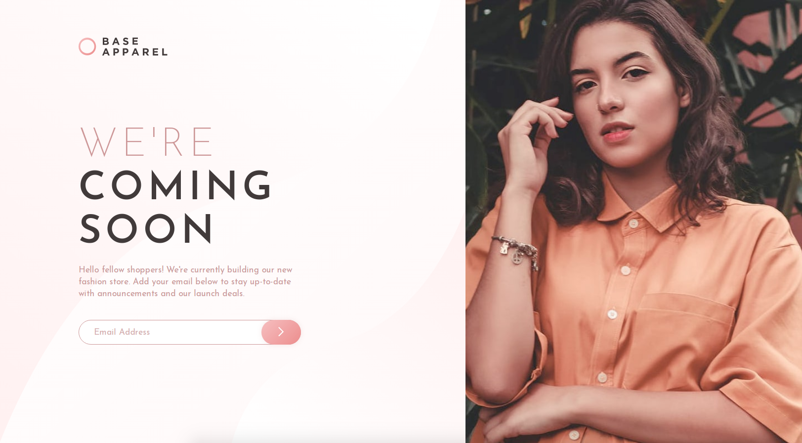

# Frontend Mentor - Base Apparel Coming Soon

## Welcome! 👋

This is a challange from the site Frontend Mentor, and the proposal is improve the skills in a real-life workflow.

In this exercise I could practice a little bit more HTML, CSS, flexbox, responsive layouts and it was good training for JavaScript.

